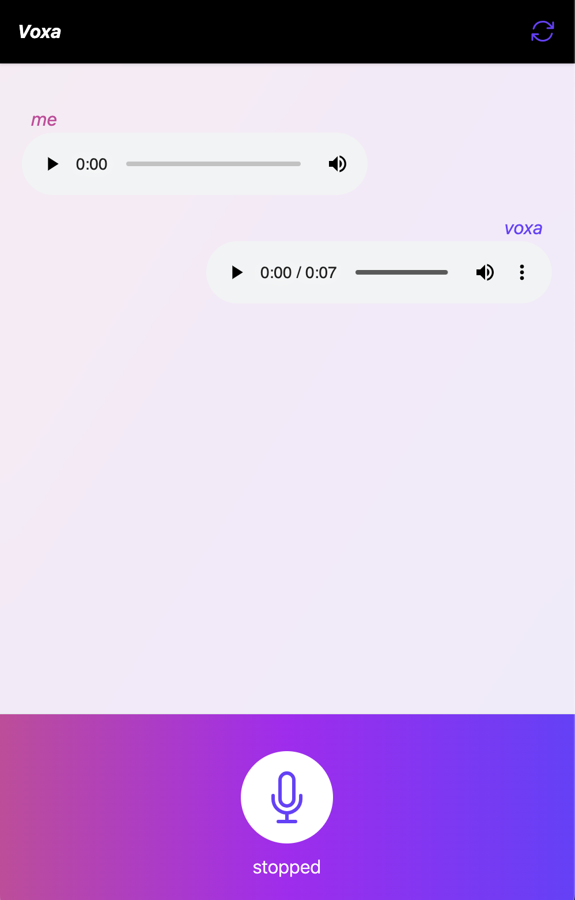

# Voxa

An AI assistant using fully voice-to-voice messages!

Fun fact: Vox means voice in Latin!

## Tech Stack

* [typescript](https://www.typescriptlang.org)
* [react](https://reactjs.org)
* [react-media-recorder](https://www.npmjs.com/package/react-media-recorder)
* [vite](https://vite.dev)
* [node.js](https://nodejs.org/en)
* [fastAPI](https://fastapi.tiangolo.com)
* [python](https://www.python.org)
* [openAI API access](https://platform.openai.com/docs/overview)
* [evelenlabs API access](https://elevenlabs.io/api)
